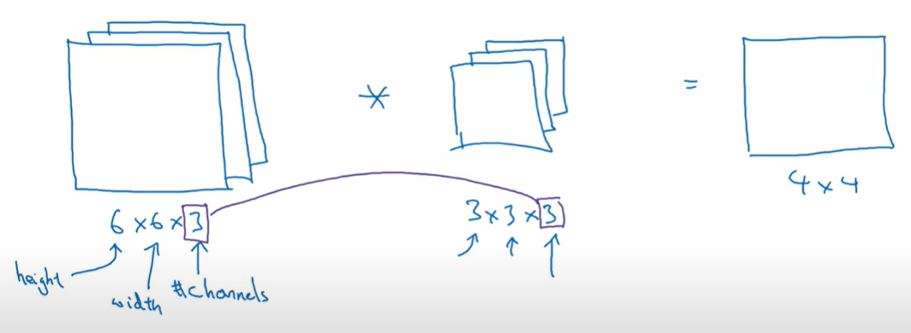

## Introduction
ConvNet architectures make the explicit assumption that the inputs are images, which allows us to encode certain properties into the architecture. 
These then make the forward function more efficient to implement and vastly reduce the amount of parameters in the network.

To learn about thousands of objects from millions of images, we need a _model with a large learning capacity_.  
CNNs constitute one such class of models: _their capacity can be controlled by varying their depth and breadth_, 
and they also make strong and mostly correct assumptions about the nature of images 
(namely, stationarity of statistics and locality of pixel dependencies).  
Thus, compared to standard feedforward neural networks with similarly-sized layers, _CNNs have much fewer 
connections and parameters and so they are easier to train, while their theoretically-best performance is 
likely to be only slightly worse_.

In particular, unlike a regular Neural Network, the layers of a ConvNet have neurons arranged in 3 dimensions: width, height, depth.

ConvNet is a sequence of layers, and every layer of a ConvNet transforms one volume of activations to another through a differentiable function. 
We use four main types of layers to build ConvNet architectures: 
- __Convolutional__ Layer: computes the output of neurons that are connected to local regions in the input, 
  each computing a dot product between their weights and a small region they are connected to in the input volume.
- __ReLU__ Layer: applies an elementwise activation function, such as the max(0,x) thresholding at zero. This leaves the size of the volume unchanged.
- __Pooling__ Layer: performs a downsampling operation along the spatial dimensions (width, height).
- __Fully-Connected__ Layer (exactly as seen in regular Neural Networks): the last layer computes the class scores, resulting in volume of size 1 × 1 × _C_, where _C_ is the numeber of classes.

### Local Connectivity
When dealing with high-dimensional inputs such as images, as we saw above it is impractical to connect neurons to all neurons in the previous volume. 
Instead, we will connect each neuron to only a local region of the input volume. 
The spatial extent of this connectivity is a hyperparameter called the __receptive field__ of the neuron (equivalently this is the __filter size__). 
The extent of the connectivity along the depth axis is always equal to the depth of the input volume. 
It is important to emphasize again this asymmetry in how we treat the spatial dimensions (width and height) and the depth dimension: 
the connections are _local in 2D space_ (along width and height), but always _full along the depth_ of the input volume.

In the figure below, a 32x32x3 input volume in red and an example volume of neurons in the first Convolutional layer. Each neuron in the convolutional layer is connected only to a local region in the input volume spatially, but to the full depth (i.e. all color channels). Note, there are multiple neurons (5 in this example) along the depth, all looking at the same region in the input: the lines that connect this column of 5 neurons do not represent the weights (i.e. these 5 neurons do not share the same weights, but they are associated with 5 different filters), they just indicate that these neurons are connected to or looking at the same receptive field or region of the input volume, i.e. they share the same receptive field but not the same weights.

However, the neurons from the classic Neural Network remain unchanged. They still compute a dot product of their weights with the input followed by a non-linearity, but their connectivity is now restricted to be local spatially.

### 2D Convolution
The dimension of the filter $`f`$ affects the dimension of the output volume in the following way:
|  Input Volume   |     Weights     | Output Volume |
| --------------- | --------------- | ----------------------------------------------------------------------------------------- |
| $$n × n × n_c$$ | $$f × f × n_c$$ | $$\left( {n + 2p -f \over s} + 1 \right) × \left( {n + 2p -f \over s} + 1 \right) × 1$$ |

with $`n_c'`$ as the number of filters, which are detecting different features. 
In the above expression there are two other variables, affecting the dimension of the output volume:
- $`s`$ (_stride_): how many pixels the filter shifts over the original image
- $`p`$ (_padding_): When moving the filter this way we see that the pixels on the edges are “touched” less by the filter than the pixels within the image. That means we are throwing away some information related to those positions. Furthermore, the output image is shrinking on every convolution, which could be intentional, but if the input image is small, we quickly shrink it too fast. A solution to those setbacks is the use of “padding”. Before we apply a convolution, we pad the image with zeros all around its border to allow the filter to slide on top and maintain the output size equal to the input. Padding will result in a “__same__” convolution.

Usually, the number of filters is greater to one, so given $`K`$ filters, the resulting output volume will be:

$$\left( {n + 2p -f \over s} + 1 \right) × \left( {n + 2p -f \over s} + 1 \right) × K$$

The following figure shows an example of 2D convolution. As shown, the dimension over the _channels_ shrink to 1:

### Pooling Layer

[Stanford cs231n Notes](https://cs231n.github.io/convolutional-networks/)

## AlexNet
In 2012 AlexNet architecture was proposed by Krizhevsky. 
- [View Paper](https://papers.nips.cc/paper_files/paper/2012/file/c399862d3b9d6b76c8436e924a68c45b-Paper.pdf)
- [View Code](https://github.com/akrizhevsky/cuda-convnet2/tree/master)

### Architecture

The net contains 8 layers with weights: the first 5 are convolutional and the remaining 3 are fullyconnected.
- The first convolutional layer has 96 kernels of size 11×11×3 with a stride of 4 pixels. It takes as input the 224×224×3 image.  
  _From [Stanford cs231n Notes](https://cs231n.github.io/convolutional-networks/): As a fun aside, if you read the actual paper it claims that the input images were 224x224, which is surely incorrect because (224 - 11)/4 + 1 is quite clearly not an integer. This has confused many people in the history of ConvNets and little is known about what happened. My own best guess is that Alex used zero-padding of 3 extra pixels that he does not mention in the paper._
- The second convolutional layer has 256 kernels of size 5×5×48. It takes as input the (response-normalized and pooled) output of the first convolutional layer. 
  Pooling layers in CNNs summarize the outputs of neighboring groups of neurons in the same kernel map.
- The third convolutional layer has 384 kernels of size 3×3×256 connected to the (normalized, pooled) outputs of the second convolutional layer.
- The fourth convolutional layer has 384 kernels of size 3×3×192
- The fifth convolutional layer has 256 kernels of size 3×3×192. 
- The final three fully-connected layers have 4096 neurons each.
- The output of the last fully-connected layer is fed to a 1000-way softmax which produces a distribution over the 1000 class labels.

The net maximizes the multinomial logistic regression objective, which is equivalent to maximizing the 
average across training cases of the log-probability of the correct label under the prediction distribution.

The ReLU non-linearity is applied to the output of every convolutional and fully-connected layer. 
ReLUs train several times faster than their equivalents with tanh units and have the desirable property that 
they do not require input normalization to prevent them from saturating. 
However, some local normalization is still applied since we find that the it aids generalization.

### DataSet
ImageNet consists of variable-resolution images, while our system requires a constant input dimensionality.  
Therefore, we down-sampled the images to a fixed resolution of 256 × 256:
- we first rescaled the image such that the shorter side was of length 256 then we cropped out the central 256×256 patch from the resulting image. 
- we did not pre-process the images in any other way, except for subtracting the mean activity over the training set from each pixel. 
So we trained our network on the (centered) raw RGB values of the pixels.

### Reducing Overfitting
#### Data Augmentation
The easiest and most common method to __reduce overfitting__ on image data is to artificially enlarge
the dataset using label-preserving transformations.
- The first form of data augmentation consists of generating image translations and horizontal reflections. 
  We do this by extracting random 224 × 224 patches (and their horizontal reflections) from the 256×256 
  images and training our network on these extracted patches. This is the reason why the input images in Figure are 224 × 224 × 3-dimensional.
- The second form of data augmentation consists of altering the intensities of the RGB channels in training images. 
  Specifically, we perform PCA on the set of RGB pixel values throughout the ImageNet training set. 
  This scheme approximately captures an important property of natural images, namely, that object identity is 
  invariant to changes in the intensity and color of the illumination.
  
At test time, the network makes a prediction by extracting five 224 × 224 patches (the four corner patches 
and the center patch) as well as their horizontal reflections (hence ten patches in all), and averaging the 
predictions made by the network’s softmax layer on the ten patches.

#### Dropout
Dropout consists of setting to zero the output of each hidden neuron with probability 0.5. The neurons which are
“dropped out” in this way do not contribute to the forward pass and do not participate in backpropagation. 
So every time an input is presented, the neural network samples a different architecture, but all these architectures share weights. 
This technique reduces complex co-adaptations of neurons, since a neuron cannot rely on the presence of particular other neurons. 
It is, therefore, forced to learn more robust features that are useful in conjunction with many different random subsets of the other neurons. 

At test time, we use all the neurons but multiply their outputs by 0.5, which is a reasonable approximation to taking 
the geometric mean of the predictive distributions produced by the exponentially-many dropout networks.

We use dropout in the first two fully-connected layers. Without dropout, our network exhibits substantial overfitting. 
However, Dropout roughly doubles the number of iterations required to converge.

### Training details
We trained our models using stochastic gradient descent with a batch size of 128 examples, momentum of 0.9, and weight decay of 0.0005. 
We found that this small amount of weight decay was important for the model to learn.
